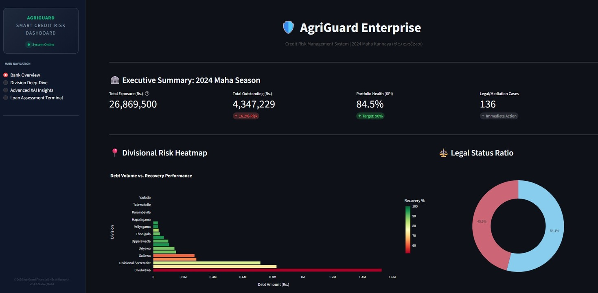
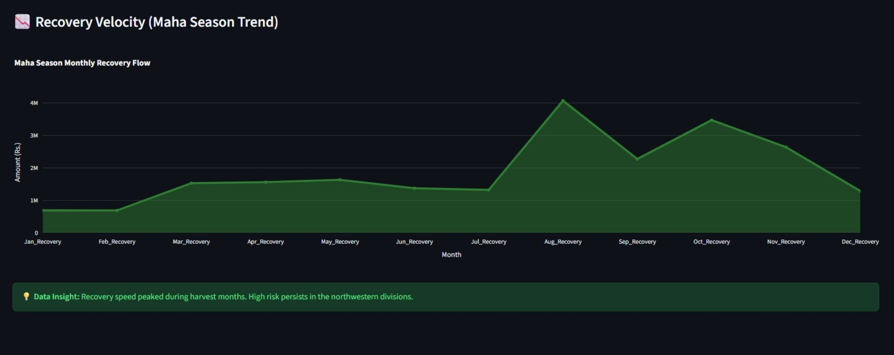
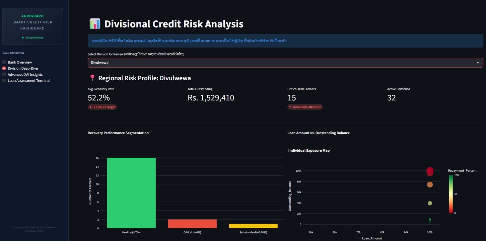
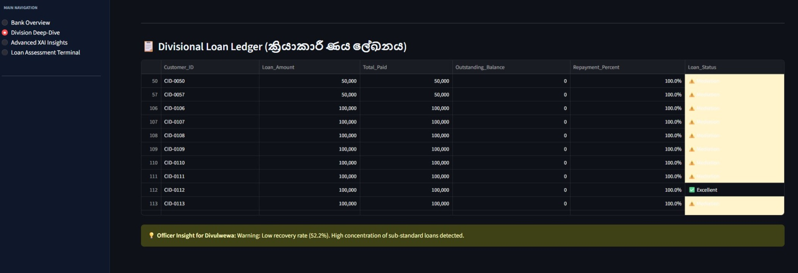
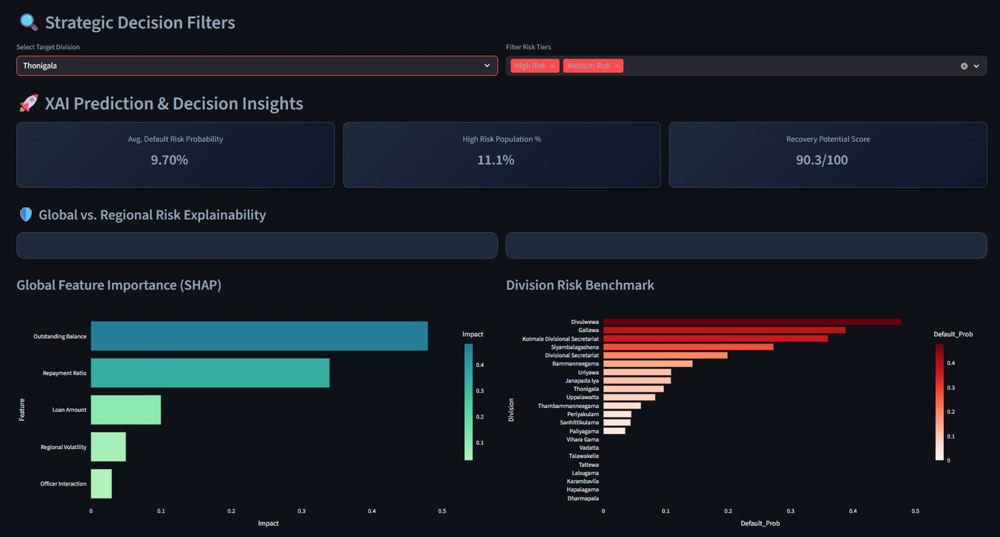
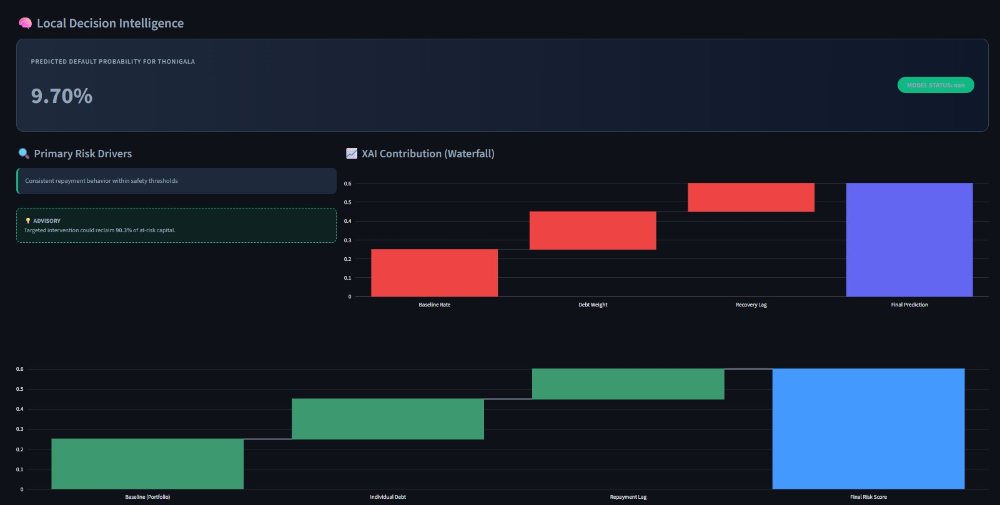
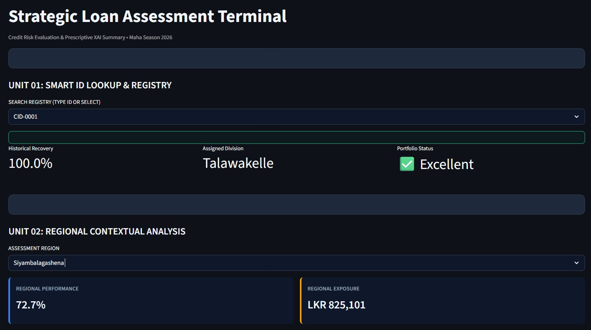
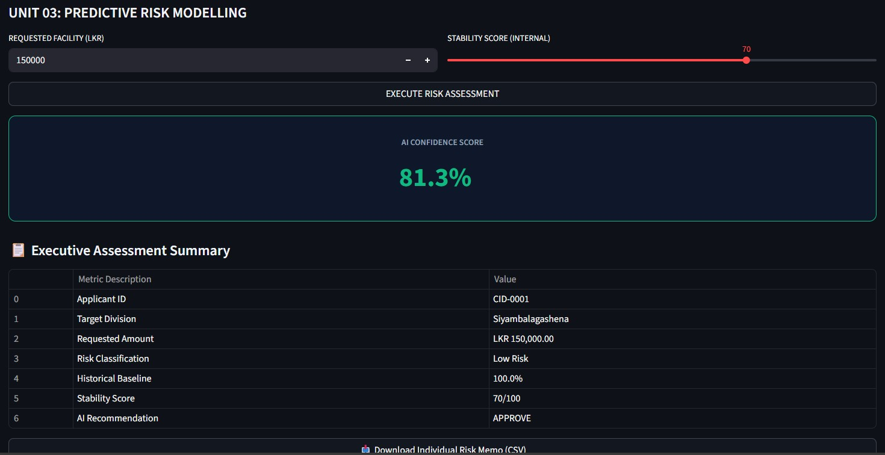
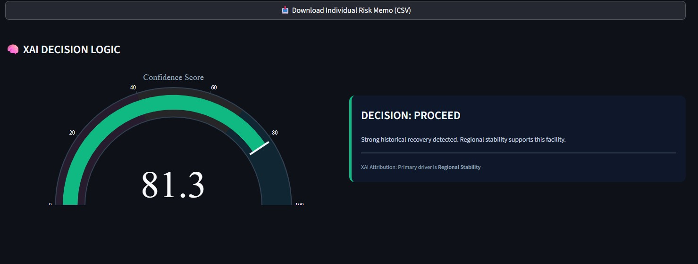

# AgriGuard — Explainable Agricultural Credit Risk Dashboard

AgriGuard is an Explainable AI (XAI)–powered agricultural credit risk analysis application. The system predicts agricultural loan default (overdue) risk in Sri Lanka using a Gradient Boosting machine learning model while providing transparent, human-interpretable explanations through SHAP. The platform combines applied machine learning with practical financial decision support to ensure predictive accuracy, transparency, and ethical AI usage.

Agricultural lending in Sri Lanka faces high uncertainty due to climate variability, income seasonality, regional disparities, and limited institutional supervision. Traditional rule-based credit assessment methods do not scale well, fail to capture nonlinear risk patterns, and lack the explainability required by modern financial regulations. AgriGuard addresses these limitations by integrating machine learning, explainable artificial intelligence, and interactive analytics into a unified decision-support system.

The primary objectives of the system are to predict whether an agricultural loan will become Overdue or Non-Overdue, identify the key drivers behind loan default, provide both global and local explanations for every prediction, and support human-in-the-loop, ethical credit decision-making.

AgriGuard provides credit risk prediction using a HistGradientBoostingClassifier trained on structured financial, behavioral, institutional, and geographic data. The interactive Streamlit dashboard offers portfolio-level risk summaries, division-wise default analysis, outstanding balance and recovery behavior insights, and officer assignment impact visualizations. Explainable AI is implemented using SHAP to generate global feature importance and local case-level explanations, ensuring transparency and auditability. An optional FastAPI backend exposes prediction functionality through a REST API, enabling system integration or deployment.

Key insights delivered by the application include the strong influence of outstanding balance on default risk, improved repayment behavior for loans with assigned officers, the presence of region-specific risk patterns across agricultural divisions, and the importance of nonlinear feature interactions in default prediction.

## 🛠️ Technology Stack

Python, Streamlit for the interactive dashboard, FastAPI and Uvicorn for the REST API layer, Scikit-learn with HistGradientBoostingClassifier for modeling, SHAP for explainable AI, Pandas and NumPy for data processing, and Plotly or Matplotlib for visualization.

## ⚙️ System Architecture

The AgriGuard platform follows a modern, modular, and explainable AI architecture designed for reliability, transparency, and extensibility in financial risk assessment systems. Streamlit acts as the frontend interface for loan officers and analysts. FastAPI serves as the backend prediction layer, handling input validation and REST requests. The core Gradient Boosting model performs risk prediction, while the SHAP engine generates global and local explanations for each prediction. The entire system is Docker-ready and suitable for cloud or on-premise institutional deployment.

System architecture diagram:

```text
+----------------------------+
|           End User         |
|   (Loan Officer / Analyst) |
+-------------+--------------+
              |
              v
+----------------------------+
|        Streamlit UI        |
|  Interactive Dashboard     |
|  - Portfolio Analytics     |
|  - XAI Visualizations      |
+-------------+--------------+
              |
              | REST Calls (JSON)
              v
+----------------------------+
|           FastAPI          |
|     Prediction API Layer   |
|  - /predict endpoint       |
|  - Input validation        |
+-------------+--------------+
              |
              v
+----------------------------+
|  ML Inference Layer        |
|  HistGradientBoosting      |
|  (Scikit-learn Model)      |
+-------------+--------------+
              |
              v
+----------------------------+
|     Explainability Layer   |
|          SHAP Engine       |
|  - Global explanations     |
|  - Local explanations      |
+-------------+--------------+
              |
              v
+----------------------------+
|   Results & Explanations   |
|  - Prediction + Risk score |
|  - Feature contributions   |
+----------------------------+


## 📁 Project Structure

Current lightweight structure:

.
├── app.py  
├── main.py  
├── advanced_analytics.py  
├── ml_monitoring.py  
├── 1_processed_loan_data_csv.csv  
├── credit_risk_model.pkl  
├── ordinal_encoder.pkl  
├── requirements.txt  
└── README.md  

Recommended scalable structure:

.
├── data/  
│   ├── raw/  
│   └── processed/  
├── notebooks/  
│   ├── preprocessing.ipynb  
│   └── model_training.ipynb  
├── scripts/  
│   ├── explainability.py  
│   └── app.py  
├── models/  
│   └── final_model.pkl  
├── requirements.txt  
└── README.md  

## 📦 All Reports and Data

The “All Reports and data” folder contains raw datasets, trained model artifacts, notebooks used for analysis and training, and final reports (PDF/DOCX), ensuring transparency and reproducibility.

## ⚡ Quickstart (Windows – PowerShell)

Activate virtual environment:  
.\.venv\Scripts\Activate.ps1  

Install dependencies:  
pip install -r requirements.txt  

Run Streamlit dashboard:  
streamlit run app.py  

## 🌐 FastAPI Service (Optional)

Start API server:  
python -m uvicorn main:app --host 127.0.0.1 --port 8000  

API documentation:  
http://127.0.0.1:8000/docs  

Example API request:

POST /predict  
{  
  "Loan_Amount": 250000,  
  "Outstanding_Balance": 180000,  
  "Total_Recovery": 70000,  
  "Officer_Assigned": 1,  
  "Agricultural_Division": "Diwulwewa"  
}  

Example API response:

{  
  "prediction": "Overdue",  
  "risk_score": 0.87  
}  

## 🔍 Explainable AI (XAI)

AgriGuard uses SHAP (SHapley Additive exPlanations) to provide global explanations that identify the most influential features across the loan portfolio and local explanations that justify individual predictions. This ensures transparency, regulatory compliance, and trust in AI-assisted credit decisions.

## 📊 Dashboard Preview (Sample Screens)

The following images are sample placeholders representing the AgriGuard dashboard. Replace them with actual screenshots after running the application.






















## ⚖️ Ethical & Responsible AI

No personally identifiable information is used. AI outputs are intended as decision support rather than automated approvals. Human oversight remains essential to prevent bias and ensure fair lending practices.

## 🛠️ Troubleshooting

If PowerShell activation is blocked:  
Set-ExecutionPolicy -Scope CurrentUser -ExecutionPolicy RemoteSigned -Force  

For dependency issues:  
python -m pip install --upgrade pip setuptools wheel  

Recommended Python version: 3.9+

## 🔮 Future Enhancements

Climate and weather data integration, satellite imagery for crop health monitoring, real-time loan monitoring and drift detection, LLM and RAG-based natural-language explanations, and fairness and bias auditing modules.

## 👤 Author

P. D. Abeysinghe  
Research Area: Explainable AI for Agricultural Credit Risk Assessment  
Country Focus: Sri Lanka  

AgriGuard — Transparent, Explainable, and Ethical AI for Agricultural Finance
